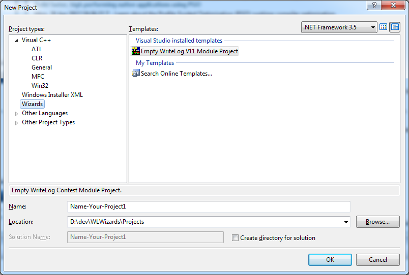

# WriteLogWizards
Tools for WriteLog contest module development
This repo contains:<ol>
<li>Source code for Visual Studio 2008 wizards that create WriteLog contest module implementations.
<li>The same for Visual Studio 2013
<li> The necessary header files and import libraries to build WriteLog contest modules.
</ol>

Developing in VS 2008 can target both WriteLog versions 11 and 12.
Developing in VS 2013 targets only WriteLog version 12. (The VS2013
C++ runtime is not installed by the WL11 installer. But modules
developed with VS 2013 will work on WL11 if that runtime happens
to be already installed.)

<h2>The Directory Structure</h2>
The wizards generate code that assumes the relative file paths set up in this repo:

<code><b>Projects/</b></code> 
Is not part of this repo, but <i>is</i> in .gitignore. It is where you should have the 
VS File/New-project wizard place any newly created WL module development projects.

<code><b>WL11ModuleWizard/</b></code> 
contains the source of the VS2008 module create wizard. 
Do NOT use VS to open any vcproj/sln/vcxproj here (more about the wizards below)

<code><b>WL11ProjectWizard/</b></code> 
contains the source of the VS2008 project create wizard.

<code><b>WL12ModuleWizard/</b></code> 
contains the source of the VS2013 module create wizard.

<code><b>WL12ProjectWizard/</b></code> 
contains the source of the VS2013 project create wizard.

<code><b>WriteLog/</b></code> 
contains the source of the various headers and import libraries required by the generated project. These headers
and libraries suffice for both WL11 and WL12 (and VS2008 and VS2013). You do NOT edit anything here, with ONE exception:

<code><b>WriteLog/include/</b></code> 
is where it is suggested you put your own common headers you want available across multiple modules. 
The wizards arrange for this directory to be in the include path for both C++ and .rc compiles, so this
is a good place to put, for example, source code for any copyright or version information you want
in common across your modules.

<pre><code><b>WriteLog/generated/
WriteLog/MmdCom/
WriteLog/wlogtools/</b></code></pre>
Don't touch these. It is also recommended that you NOT use any headers you find in there
for your development because much of it is archaic. The reason the archaic stuff remains is
to enable source-code compatible development of module developed using the old Visual Studio 6
wizard last updated in 2008 (and most of which dates from 2000)

<h2>The wizards</h2>
You must already have VS 2008 and/or VS 2013 installed. The Express versions are NOT supported.
It takes two wizards to create a WriteLog contest module:<ol>
<li>The WL11ProjectWizard (or WL12ProjectWizard) creates a skeleton project in VS File/New-Project menu.
<li>The WL11ModuleWizard (or WL12ModuleWizard) adds skeleton header/cpp files to such a project for a contest. 
</ol>
<h3>Deploying the wizards</h3>
There are a total of four wizards: two each for VS 2008 and VS 2013. The instructions for deployment are
almost identical for the two versions. There is more than one way to accomplish deployment, but here
is one that works and is minimally intrusive on your system.

In all four cases is is NOT necessary to use Visual Studio to File/Open-Project of any of the
.sln/.vcproj/.vcxproj files in the repo <code>WL</code><i>nnProject/Module</i><code>Wizard/</code> folders. Doing so MIGHT cause VS to auto-magically 
deploy the wizard, which might or might not conflict with the instructions below. Of course, if you
don't like the way the wizards work, you are welcome to change them to suit yourself.

<h4>Deploy the Project Wizard</h4>
Visual Studio should have already created the directory <code><i>&lt;MyDocuments&gt;</i>\Visual Studio 2008&#92;</code>. Create a subfolder named <code><b>Wizards</b></code> and copy these 3 files from the <code>WL11ProjectWizard</code> repo folder into <code><i>&lt;MyDocuments&gt;</i>\Visual Studio 2008&#92;Wizards</code>: <ul>
<li>WL11ProjectWizard.ico
<li>WL11ProjectWizard.vsdir
<li>WLProjectWizard.vsz
</ul> 
Edit that last file, the .vsz file to correct the absolute path:
<pre><code>Param="ABSOLUTE_PATH = c:\wherever\WriteLogWizards\WL11ProjectWizard"</code>
</pre>There is no need to copy the files out of your git work area: just point the .vsz file to the appropriate subdirectory.

Now File/New Project in Visual Studio 2008 should show this:

The deployment of the WL12 wizard is the same, except substitute to WL12 for WL11, and substitute 2013 for 2008.

<h4>Deploy the ModuleWizard</h4>
Getting a new item into the Visual Studio Add/New-Item menu requires administrator privilege. 
You must create files in the Visual Studio installation directory. The directory to find is:
<pre><code>C:\Program Files (x86)\Microsoft Visual Studio 9.0\VC\vcprojectitems</code>
</pre>In that vcprojectitems directory, you need two things: <ul>
<li>Create a folder named <code>LocalItems</code>.
<li>Into that same vcprojectitems folder, copy the file (unchanged) from this repo: <code>WL11ModuleWizard/LocalItems/LocalItems.vsdir</code>.
</ul>
Into that newly created LocalItems folder, copy these three files:<ol>
<li>WL11ModuleWizard.ico
<li>WL11ModuleWizard.vsdir
<li>WL11ModuleWizard.vsz
</ol>
That .vsz file must be edited to correct the <code>ABSOLUTE_PATH</code>. Again, there is no need to copy files out of the git work area: just point that vsz file to the appropriate subdirectory in the work area. Once installed, and in Visual Studio with a WL project open, a right mouse clock on the project looks like this:

The Add New Item may be repeated in order to support more than one contest from a single .DLL. For the WL12 wizard, use the files in WL12ModuleWizard and use the Visual Studio 2013 installation directory, but otherwise all is the same.

<h2>Installer support</h2>
The wizards described above generate code for a WIX installation using the kits available at http://wixtoolset.org/. While 
the dll's created by the wizard support self-registration, that is <b>not</b> a recommended means of installation.
Use the .wxs files generated by the wizard to create an msi installer for your module.

Generating the installer is not fully automated. The Project wizard generates a product.wxs suitable to be added to a 
"Windows Installer XML" Setup project. And the Module wizard generates a <module-name>.wxs suitable to be added to 
that same Windows Installer project. These .wxs files are "loose" in the dll's project--they are not referenced by or
needed by the dll project.

Create the installer project after you have done a successfull Release build of with all the contest modules you want in your project dll. The relative include paths in the generated .wxs files assume this new installer project is placed in the same 
Projects/ folder as the module projects. Use Visual Studio File/New-Project and choose "Windows Installer XML" and "Setup Project". 

That generated a product.wxs that you discard. Replace it with the product.wxs moved from where WriteLog Product 
wizard generated it. At the same time, move the <module-name>.wxs files that the WriteLog Module
wizard generated.

With the installer project open in Visual Studio, do a right mouse click on the install project and Add/Existing-item
and add the <module-name>.wxs file. The project also needs a Reference to WixUIExtension that comes with WIX.

Edit the various TODO's in the two wxs files. (Or more wxs files if you put support more than one contest in your
project). 

<h2>Source code changes required for older modules</h2>
There are a handful of bugs in the header files generated using the old Visual Studio 6 
WriteLog contest wizard. It is recommended that any new work on those old modules be
done using the software development environment published here, and with Visual Studio
2008 (or VS 2013 if WL12 and later support is all that is desired.)

There are a couple of source code changes required in old modules to make them compile:
<ol>
<li> Place the old source code directory in the new Projects folder here.
<li>The include path structure has changed. The easiest way to deal 
with this is to edit only the .vcproj as text. 
<ul><li>Replace this: <code>..\..\Wlogtool</code>
with <code>..\..\WriteLog\Wlogtool</code>. 
<li>Similarly, replace <code>..\..\include</code> 
with <code>..\..\WriteLog\include</code>. 
<li>This one is slightly different: <code>..\mmdcom</code> becomes
<code>..\..\WriteLog\mmdcom</code>.
<li>Finally, to the include file paths, add this directory which did
not appear in the old wizard: <code>..\..\WriteLog\generated</code>
</ul>
<li>The clsid.c file won't compile anymore. Because it references headers that now only work in C++.
Using the VS Solution explorer, rename it to clsid.cpp.
<li>clsid.cpp still might not compile if the &lt;projectname&gt;mm.h file won't compile stand-alone.
One simple way to fix this is to split out from &lt;projectname&gt;mm.h the bit that clsid.cpp needs
into a separate file.
<ul>
<li>Create a new header file named, say, &lt;projectname&gt;guid.h.
<li>Cut from &lt;projectname&gt;mm.h all the lines that look like this:  
<code>DEFINE_GUID(CLSID_EuRttyMmd, 0xC7212160, 0x7716, 0x101A,
	0xAA, 0x54, 0x00, 0x60, 0x8C, 0x61, 0xD0, 0xB1);
/* C7212160-7716-101A-AA54-00608C61D0B1 */
</code>
<li> and paste those lines into &lt;projectname&gt;guid.h
<li> Update &lt;projectname&gt;mm.h to #include the new guid.h
<li> Change clsid.cpp to #include the new guid.h <i>instead of</i> mm.h.
</ul>
</ol>

