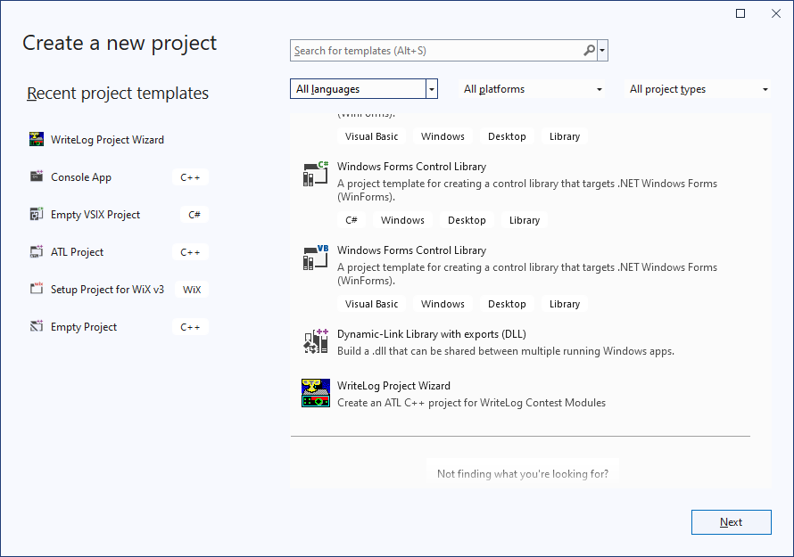
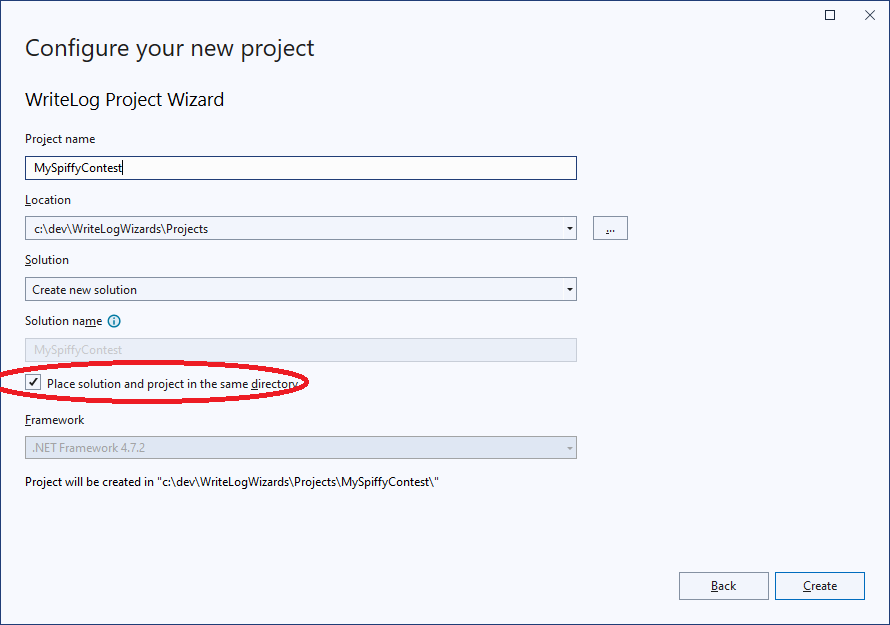
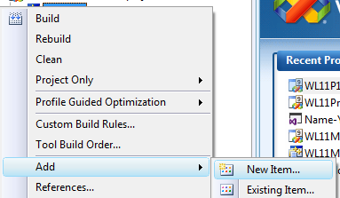
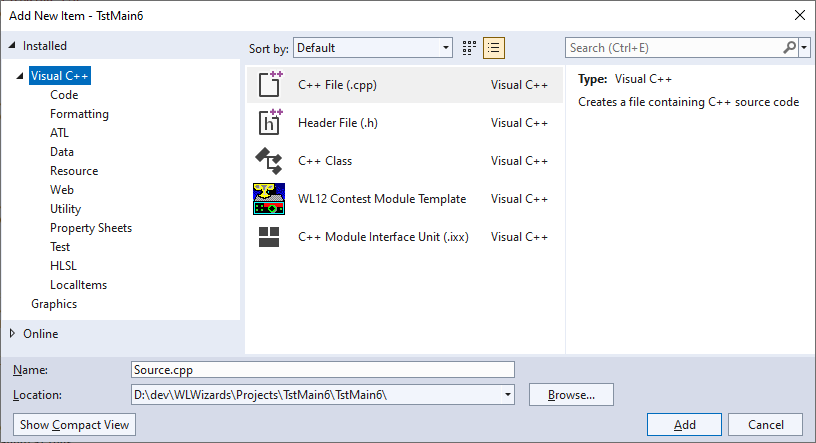
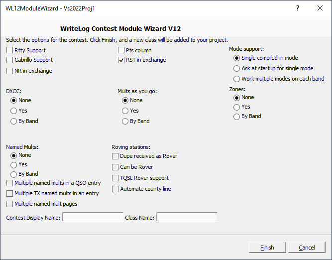

# VSIX WriteLogWizards
Tools for WriteLog contest module development.
This repo contains:<ol>
<li>The necessary header files and import libraries to build and install WriteLog contest modules.
<li>Wizards for Visual Studio versions 2019, 2022 and 2026
<li>Source code for those wizards in item (2).
</ol>

The list above is in priority order. That is, you must have item (1) in order to develop a WriteLog
contest dll. The <code><b>WriteLog</b></code> folder has what is needed. Item (2) you may use to generate a 
Visual Studio project and classes within
it using helper classes in the headers and libraries, but nothing forces you to use
the wizards to create source code.  Item (3) is unlikely you'll need. See the bottom of this page for more.

Developing this kit targets only WriteLog version 12. The
resulting dll's can be installed without the VC++ runtimes unless you care to
support yours being installed in WriteLog versions older than 12.55. In that case,
you must arrange to install the newer C++ runtimes (v142 and later).

This November 2025 update is a complete re-implementation using VSIX technology compared to the 
WriteLog module development kit posted here for many years. Users of those older wizards
will hardly notice a difference, except that these are far simpler to install into your
Visual Studio development system. Specifically:
<ul>
<li>The GUI presented in Visual Studio for adding a Project and a contest's Project Item 
is almost unchanged from the .vsz version.
<li>In all Visual Studio versions, there is a WriteLog V12 "New Project" template under Visual Studio's
File/New-Project, and there is a WL12 Contest Module Template under Visual Studio "Add New Item..."
</ul>

<h2>The Directory Structure</h2>

You start by cloning or duplicating this git repository. Unless you expect to change the wizards themselves,
you do not need to keep any of the cloned folders under version control. Use version control on
the files you place under the <code><b>Projects</b></code> folder. You also need a version of Visual Studio
installed.

The wizards generate code that <i>assumes</i> the relative file paths set up in this repository, else Visual
Studio will be unable to build them:

<code><b>Projects/</b></code> 
It is
required when you create a new project (vcxproj) that you CHECK ON the "put sln and project 
in the same folder button", and that you place your new project in this <code><b>Projects/</b></code>  folder.
The folder is not archived in this repository, and is prevented from that by .gitignore.

<code><b>WriteLog/</b></code> 
contains the source of the various headers and import libraries required by the generated project. These headers
and libraries suffice for both WL11 and WL12 (all versions of Visual Studio). 
You do <i>not</i> edit anything here.

<pre><code><b>WriteLog/generated/
WriteLog/MmdCom/
WriteLog/wlogtools/</b></code></pre>
Don't touch these. It is also recommended that you <i>not</i> use any headers you find in there
for your development because much of it is archaic. The reason the archaic stuff remains is
to enable source-code compatible development of module developed using the old Visual Studio 6
wizard last updated in 2008 (and most of which dates from 2000--or earlier.)

<code><b>WL12ModuleItem/</b></code> 
contains the source of the module create wizard VSIX component. This is internal wizard implementation
details

<code><b>WL12ProjectWizard/</b></code> 
contains the source of the project create wizard.This is internal wizard implementation details.

<h2>The wizards</h2>
You must already have VS 2019, 2022, or 2026 installed. 

<h3>Deploying the wizards</h3>
The <b>Releases</b> tab on github for this repository has links to version-specific zip
files containing the wizard code. Download the appropriate zip file and unzip it into
any temporary folder you choose. Look at the ReadMe.txt there for further instructions.
There are two wizards: one for creating a project, and one for adding a module to a project.
The zip file has a separate <code>cmd</code> file for install each. The <code>cmd</code> files 
can be run multiple
times if you think they didn't work. The module wizard can only be uninstalled using the
Visual Studio installer. The project wizard install is simply a copy of a zip file placed
in a Visual Studio specific sub folder of your Documents folder. You have to track the
zip file down and delete  it manually to uninstall.

<h3>Create a project and add a contest</h3>

Once installed, and in Visual Studio, use File/New-Project and find the WriteLog
Project wizard.

Be sure to <ul>
<li>Check the Place solution and project in the same directory
<li>Place the new file in the Projects directory of this repository, as shown.
</ul>

with a WL project open, a right mouse click on the project looks like this:

You use the Add New Item repeatedly in order to support more than one contest from a single .DLL. 
The module wizard presents these options.

<ul>
<li><i>Rtty Support</i> adds the interfaces that the RttyRite window needs to fully 
support highlighting and clicking into WriteLog's Entry Window.
<li><i>Cabrillo Support</i> adds enough cabrillo support for basic export.
<li><i>NR in exchange</i>  instructs the wizard to add an NR column to the log.
<li><i>Pts Column</i> adds a column to the log to display the points claimed for each QSO.
<li><i>RST in exchange</i> adds sent/received RST columns to the log.
<li><i>Mode support</i> selects among 3 choices.
<ul><li><i>compiled-in</i> The modes (CW/SSB/RTTY) are decided at compile time. Many RTTY contests are examples.
   <li><i>ask at startup</i> For a given weekend, only one mode (or set of modes) is allowed,
   but you need to ask the user which. Think ARRL SS CW versus SSB.
   <li><i>multi-mode</i> means that the contest rules are that on a given frequency band,
   contestants can make separate QSOs for credit on multiple modes. Think IARU HF.
</ul>
<li><i>DXCC</i> means the contest counts DXCC countries as multipliers, and the wizard
generates code for the case of countries as mults once per contest, or once per band.
<li><i>Zones</i> means the contest counts zones as multipliers. The wizard generates
support for zones 1 - 40 (per CQ zones) but you can change this to use ITU zones instead.
<li><i>Mults as you go</i> means that every unique string logged for a field is
a separate multiplier, but you don't know when the contest starts what
they're going to be. This can be used for logging those contests where the
"headquarters stations" are their own multipliers. WPX also works this way.
<li><i>Named Mults</i> means there is a list of strings (like state names, or whatever)
that are the multipliers for the contest. You will need to create (and distribute)
an INI file that has the multipliers in it along with any ALIAS names you want
to all refer to the same multiplier
<ul>
<li><i>Multiple named mults in a QSO Entry</i> generates code to handle receipt of multiple states, provinces, counties, etc.
all in one entry with a comma, hyphen or slash between them.
<li><i>Multiple TX named mults in an entry</i> generates the additional code when the log is from a juristiction that allows
transmitting multiple QTHs as one QSO. Not all QSO party rules allow for this. Some require a separate QSO per.
<li><i>Multiple named mult pages</i> generates code for the module to support, for example, named states separate from
named provinces separate from named counties.
<li><i>Roving Stations</i>
<ul>
<li><i>Dupe received as Rover</i> The received exchange makes a matching call and band 
not a duplicate.</li>
<li><i>Can be rover</i> You change to a different county or grid and work stations again.</li>
<li><i>Automate county line</i> When operating from a county/grid boundary, press TAB on an empty QSO Window
and WriteLog fills in the next county/grid you haven't already logged for that call and band.</li>
</ul></li>
</ul>
<li><i>Contest Display Name</i> is what the user will see in the WriteLog Select Contest list.
<li><i>Class Name</i> is the name of the C++ class to be generated. The wizard has to generate
a name for the corresponding COM coclass which it does this way: if you start the name of the 
class with a "C" (capital C) then the coclass is the name of the C++ class with no leading C. 
Otherwise, the name of the coclass is the name of the C++ class with CoClass appended.
</ul>

<h2>Installer support</h2>
The wizards described above generate code for a WIX installation using the kits available at http://wixtoolset.org/. Installing the WIX tool set after Visual Studio will result in Visual Studio support for WIX installer projects. While 
the dll's created by the wizard support self-registration, that is <b>not</b> a recommended means for registration when
deployed on customer machines (but its fine for use in development.)
For customer depoloyment, use the .wxs files generated by the WriteLog wizards to create an msi installer for your module.

Generating the installer is not fully automated by these wizards. The Project wizard generates a product.wxs suitable to be added to a 
"Windows Installer XML" Setup project. And the Module wizard generates a <module-name>.wxs suitable to be added to 
that same Windows Installer project. But these .wxs files are just "loose" in the dll's project--they are not referenced by or
needed by the dll project. This readme does not attempt to document how to use the Visual Studio support for the Wix
installer. This is just enough information to get you started.

Create the installer project after you have done a successfull Release build of with all the contest modules you want in your project dll. The relative include paths in the generated .wxs files assume this new installer project is placed in the same 
Projects/ folder as the module projects. Use Visual Studio File/New-Project and choose "Windows Installer XML" and "Setup Project". 

The Visual Studio wizard generated a file named product.wxs that you discard. Replace it with the product.wxs moved from where WriteLog Product 
wizard generated it. At the same time, move the <module-name>.wxs files that the WriteLog Module
wizard generated.

With the installer project open in Visual Studio, do a right mouse click on the install project and Add/Existing-item
and add the <module-name>.wxs file. The project also needs a Reference to WixUIExtension that comes with WIX.

Edit the various TODO's in the two wxs files. (Or more wxs files if you put support more than one contest in your
project). 

<h2>Change the wizards?</h2>
The wizard code is here in the repository, but is unlikely you'll ever touch it. 
Unless you don't like the way the wizards work, simply do not ever open any of the solution or project
files except those you create under the <code><b>Projects</b></code> folder. Changing the wizards
also requires you to use a git branch specific to the Visual Studio version for the wizard you want to change.