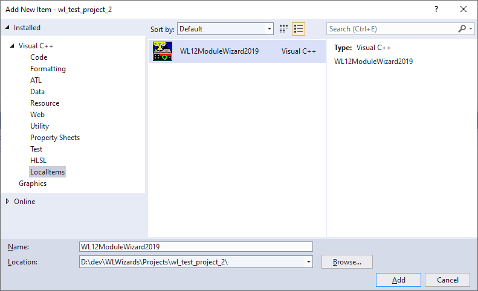

# WriteLogWizards
Tools for WriteLog contest module development
This repo contains:<ol>
<li>Check branches in this repo for older versions of Visual Studio
<li>Source code for Visual Studio 2019 wizards that create WriteLog contest module implementations.
<li>Instructions for using Visual Studio 2019 Community Edition.
<li> The necessary header files and import libraries to build WriteLog contest modules.
</ol>

Developing in VS 2019 targets only WriteLog version 12. (The VS2013 nor VS2019
C++ runtime is not installed by the WL11 installer.)
Developing in VS 2019 can target both WriteLog 11 and 12, <b>but</b> you must arrange to install
the VS 2019 runtime when your module is installed on WriteLog versions older than 12.55.

<h2>The Directory Structure</h2>
The wizards generate code that assumes the relative file paths set up in this repo:

<code><b>Projects/</b></code> 
Is not part of this repo, but <i>is</i> in .gitignore. It is where you should have the 
VS File/New-project wizard place any newly created WL module development projects.

<code><b>WL12ModuleWizard/</b></code> 
contains the source of the module create wizard.

<code><b>WL12ProjectWizard2019/</b></code> 
contains the source of the VS2019 project create wizard.

<code><b>WriteLog/</b></code> 
contains the source of the various headers and import libraries required by the generated project. These headers
and libraries suffice for both WL11 and WL12 (all versions of Visual Studio). You do <i>not</i> edit anything here, with <b>one</b> exception:

<code><b>WriteLog/include/</b></code> 
is where it is suggested you put your own common headers you want available across multiple modules. 
The wizards arrange for this directory to be in the include path for both C++ and .rc compiles, so this
is a good place to put, for example, source code for any copyright or version information you want
in common across your modules.

<pre><code><b>WriteLog/generated/
WriteLog/MmdCom/
WriteLog/wlogtools/</b></code></pre>
Don't touch these. It is also recommended that you <i>not</i> use any headers you find in there
for your development because much of it is archaic. The reason the archaic stuff remains is
to enable source-code compatible development of module developed using the old Visual Studio 6
wizard last updated in 2008 (and most of which dates from 2000--or earlier.)

<h2>The wizards</h2>
You must already have VS 2019 installed. The Community Edition 2019 is 
supported for WriteLog module development.
It takes two wizard operations to create a WriteLog contest module:<ol>
<li>The wl12ProjectWizard2019 creates a skeleton project from the VS File/New-Project menu.
<li>The WL12ModuleWizard adds skeleton header/cpp/wxs files to such a project for a contest. 
</ol>
<h3>Deploying the wizards</h3>
There are two wizards: one for creating a project, and one for adding a module to a project.
Follow the one-time editing instructions below.
There is more than one way to accomplish deployment, but here
is one that works and is minimally intrusive on your system.

For all wizards it is not necessary to use Visual Studio to File/Open-Project of any of the
.sln/.vcproj/.vcxproj files in the repo Wizard/ folders. Doing so MIGHT cause VS to auto-magically 
deploy the wizard in your <code><i>&lt;MyDocuments&gt;</i></code> folder, which might or might not conflict with the instructions below. Of course, 
if you don't like the way the wizards work, you are welcome to change them to suit yourself.

<h4>Deploy the Project Wizard</h4>
Visual Studio should have already created the directory <code><i>&lt;MyDocuments&gt;</i>&#92Visual Studio 2019&#92;</code>. 
Create a subfolder named 
<code>&#92Wizards&#92</code> and copy these 3 files (and only these 3) from the <code>WL12ProjectWizard2019</code> 
repo folder: <ul>
<li>WL12ProjectWizard2019.ico
<li>WL12ProjectWizard2019.vsdir
<li>WL12ProjectWizard2019.vsz
</ul> 
Edit that last file, the .vsz file, to correct the absolute path. Make it point to the corresponding directory in your fetched version of this git repo:
<pre><code>Param="ABSOLUTE_PATH = c:\wherever\WriteLogWizards\WL12ProjectWizard2019"</code>
</pre>.

There is no need to copy the files out of your git work area.

Now File/New Project in Visual Studio should show this entry that wasn't there before. 

In order for the directory structure to match that assumed by the module wizard, when creating a
new project, browse to the Projects directory in this repo (create it, if necessary),
and turn <b>on</b> the <i>Place solution and project in the same directory</i> check box.

<h4>Deploy the ModuleWizard</h4>
Getting a new item into the Visual Studio Add/New-Item menu apparently cannot be done
in My Documents like a project wizard. Its deployment requires administrator privilege. 
You must create files in the Visual Studio installation directory. The directory to find is:
<pre><code>C:\Program Files (x86)\Microsoft Visual Studio\2019\Community\Common7\IDE\VC\vcprojectitems</code> 
</pre>In that vcprojectitems directory, you need two things: <ul>
<li>Create a folder named <code>LocalItems</code>.</li>
<li>Into that same vcprojectitems folder, copy the file (unchanged) from this repo: 
<code>WL12ModuleWizard/Deploy/LocalItems.vsdir</code>.</li>
</ul>
And then into that newly created LocalItems folder, copy these three files from the repo's WL12ModuleWizard folder:<ol>
<li>WL12ModuleWizard2019.ico</li>
<li>WL12ModuleWizard2019.vsdir</li>
<li>WL12ModuleWizard2019.vsz</li>
</ol>
That .vsz file must be edited to correct the <code>ABSOLUTE_PATH</code>. Again, there is no need to copy files out of the git work 
area: just point that vsz file to the appropriate subdirectory in your fetched copy of this git repo. Once installed, and in 
Visual Studio with a WL project open, a right mouse click on the project looks like this:

You use the Add New Item repeatedly in order to support more than one contest from a single .DLL. 
The module wizard presents these options.

<ul>
<li><i>Rtty Support</i> adds the interfaces that the RttyRite window needs to fully 
support highlighting and clicking into WriteLog's Entry Window.
<li><i>Cabrillo Support</i> adds enough cabrillo support for basic export.
<li><i>NR in exchange</i>  instructs the wizard to add an NR column to the log.
<li><i>Pts Column</i> adds a column to the log to display the points claimed for each QSO.
<li><i>RST in exchange</i> adds sent/received RST columns to the log.
<li><i>Mode support</i> selects among 3 choices.
<ul><li><i>compiled-in</i> The modes (CW/SSB/RTTY) are decided at compile time. Many RTTY contests are examples.
   <li><i>ask at startup</i> For a given weekend, only one mode (or set of modes) is allowed,
   but you need to ask the user which. Think ARRL SS CW versus SSB.
   <li><i>multi-mode</i> means that the contest rules are that on a given frequency band,
   contestants can make separate QSOs for credit on multiple modes. Think IARU HF.
</ul>
<li><i>DXCC</i> means the contest counts DXCC countries as multipliers, and the wizard
generates code for the case of countries as mults once per contest, or once per band.
<li><i>Zones</i> means the contest counts zones as multipliers. The wizard generates
support for zones 1 - 40 (per CQ zones) but you can change this to use ITU zones instead.
<li><i>Mults as you go</i> means that every unique string logged for a field is
a separate multiplier, but you don't know when the contest starts what
they're going to be. This can be used for logging those contests where the
"headquarters stations" are their own multipliers. WPX also works this way.
<li><i>Named Mults</i> means there is a list of strings (like state names, or whatever)
that are the multipliers for the contest. You will need to create (and distribute)
an INI file that has the multipliers in it along with any ALIAS names you want
to all refer to the same multiplier
<li><i>Roving Stations</i>
<ul>
<li><i>Dupe received as Rover</i> The received exchange makes a matching call and band 
not a duplicate.</li>
<li><i>Can be rover</i> You change to a different county or grid and work stations again.</li>
<li><i>Automate county line</i> When operating from a county/grid boundary, press TAB on an empty QSO Window
and WriteLog fills in the next county/grid you haven't already logged for that call and band.</li>
</ul></li>
<li><i>Contest Display Name</i> is what the user will see in the WriteLog Select Contest list.
<li><i>Class Name</i> is the name of the C++ class to be generated. The wizard has to generate
a name for the corresponding COM coclass which it does this way: if you start the name of the 
class with a "C" (capital C) then the coclass is the name of the C++ class with no leading C. 
Otherwise, the name of the coclass is the name of the C++ class with CoClass appended
</ul>

<h2>Installer support</h2>
The wizards described above generate code for a WIX installation using the kits available at http://wixtoolset.org/. Installing the WIX tool set after Visual Studio will result in Visual Studio support for WIX installer projects. While 
the dll's created by the wizard support self-registration, that is <b>not</b> a recommended means for registration when
deployed on customer machines (but its fine for use in development.)
For customer depoloyment, use the .wxs files generated by the WriteLog wizards to create an msi installer for your module.

Generating the installer is not fully automated by these wizards. The Project wizard generates a product.wxs suitable to be added to a 
"Windows Installer XML" Setup project. And the Module wizard generates a <module-name>.wxs suitable to be added to 
that same Windows Installer project. But these .wxs files are just "loose" in the dll's project--they are not referenced by or
needed by the dll project. This readme does not attempt to document how to use the Visual Studio support for the Wix
installer. This is just enough information to get you started.

Create the installer project after you have done a successfull Release build of with all the contest modules you want in your project dll. The relative include paths in the generated .wxs files assume this new installer project is placed in the same 
Projects/ folder as the module projects. Use Visual Studio File/New-Project and choose "Windows Installer XML" and "Setup Project". 

The Visual Studio wizard generated a file named product.wxs that you discard. Replace it with the product.wxs moved from where WriteLog Product 
wizard generated it. At the same time, move the <module-name>.wxs files that the WriteLog Module
wizard generated.

With the installer project open in Visual Studio, do a right mouse click on the install project and Add/Existing-item
and add the <module-name>.wxs file. The project also needs a Reference to WixUIExtension that comes with WIX.

Edit the various TODO's in the two wxs files. (Or more wxs files if you put support more than one contest in your
project). 

<h2>Source code changes required for older modules</h2>
There are a handful of bugs in the header files generated using the old Visual Studio 6 
WriteLog contest wizard. It is recommended that any new work on those old modules be
done using the software development environment published here, and with Visual Studio
2008 (or VS 2013 if WL12 and later support is all that is desired.) Start by placing
the old module's source code in its own new folder under Projects in the directory
tree created by this repo. You do not run any of the wizards in order to rebuild an old project. This
exercise is just to use the latest versions of the header files, which have some
templates and preprocessor directives that have been improved since the VS 6 wizard 
was deployed.

There are a couple of source code changes required in old modules to make them compile
in this updated environment:
<ol>
<li> Place the old source code directory in the new Projects folder here.
<li>The include path structure has changed. The easiest way to deal 
with this is to edit only the .vcproj as text. 
<ul><li>Replace this: <code>..\..\Wlogtool</code>
with <code>..\..\WriteLog\Wlogtool</code>. 
<li>Similarly, replace <code>..\..\include</code> 
with <code>..\..\WriteLog\include</code>. 
<li>This one is slightly different: <code>..\mmdcom</code> becomes
<code>..\..\WriteLog\mmdcom</code>.
<li>Finally, to the include file paths, add this directory which did
not appear in the old wizard: <code>..\..\WriteLog\generated</code>
</ul>
<li>The clsid.c file won't compile anymore. Because it references headers that now only work in C++.
Using the VS Solution explorer, rename it to clsid.cpp.
<li>clsid.cpp still might not compile if the &lt;projectname&gt;mm.h file won't compile stand-alone.
One simple way to fix this is to split out from &lt;projectname&gt;mm.h the bit that clsid.cpp needs
into a separate file.
<ul>
<li>Create a new header file named, say, &lt;projectname&gt;guid.h.
<li>Cut from &lt;projectname&gt;mm.h all the lines that look like this:  
<code>DEFINE_GUID(CLSID_EuRttyMmd, 0xC7212160, 0x7716, 0x101A,
	0xAA, 0x54, 0x00, 0x60, 0x8C, 0x61, 0xD0, 0xB1);
/* C7212160-7716-101A-AA54-00608C61D0B1 */
</code>
<li> and paste those lines into &lt;projectname&gt;guid.h
<li> Update &lt;projectname&gt;mm.h to #include the new guid.h
<li> Change clsid.cpp to #include the new guid.h <i>instead of</i> mm.h.
</ul>
</ol>

